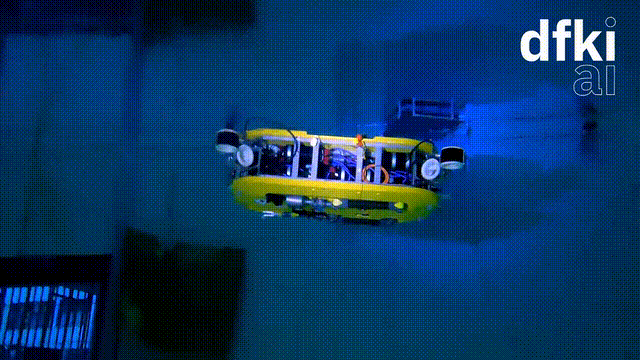

<center>
<h1>Attitude Control of the Hydrobatic Intervention AUV Cuttlefish using Incremental Nonlinear Dynamic Inversion</h1>
<h3>Tom Slawik, Shubham Vyas, Leif Christensen, Frank Kirchner*</h3>

</center>
*) All authors are affiliated with the German Research Center for Artificial
Intelligence (DFKI GmbH), Robotics Innovation Center, Robert-Hooke-
Straße 1, 28359 Bremen, Germany. (e-mail: tom.slawik@dfki.de)

## Abstract
In this paper, we present an attitude control
scheme for an autonomous underwater vehicle (AUV), which
is based on incremental nonlinear dynamic inversion (INDI).
Conventional model-based controllers depend on an exact model of the controlled system, which is difficult to find, especially
for marine vehicles subject to highly nonlinear hydrodynamic
effects. INDI trades off model accuracy with sensor accuracy
by incorporating acceleration feedback and actuator output
feedback to linearize a nonlinear system incrementally. Existing
research primarily focuses on studying INDI on unmanned
aerial vehicles. However, there is barely any research on
controlling marine vehicles using INDI. The control task we are
performing is a 90 degrees pitch-up maneuver, where the dual-arm intervention AUV Cuttlefish transitions from a horizontal
traveling pose to a vertical intervention pose. We compare INDI
to a classical model-based control scheme in the maritime test
basin at DFKI RIC, Germany, and we find that INDI keeps
the AUV much more steady both in the transitioning phase as
well as in the station keeping phase.

## Simulation
Before running the simulation, install the required Python packages:
```
sudo apt update && sudo apt install python3 python3-pip
pip3 install -r requirements.txt
```

### Pose Controller Simulation
run

``` python3 examples/cuttlefish_pose_indi.py ```

to simulate the pose controller using INDI. The simulation using NDI / Model-Based control can be realized by running

``` python3 examples/cuttlefish_pose_ndi.py ```.

In each script there is a parameter section, where you can change the initial conditions, setpoints, controller gains, and the filtering parameters. It is also possible to add Gaussian noise to the sensor readings.

For simulation, two motion models are loaded: One for the simulated vehicle, and one for the controller. The control model can be perturbed by setting ` motion_model_controller_randomize ` to a value ranging from 0.0 to 0.8, where 0.8 randomizes each model parameter by 80%.

By increasing the control model perturbation, it can be seen from the plots that it affects the model-based controller much more than INDI. 

### Velocity Controller Simulation

For completeness, we also provide a simulation for controlling the velocity independent of a controlled pose.
You can run the simulation using INDI by executing ` python3 examples/cuttlefish_velocity_indi.py `, and the simulation using the model-based controller by running ` python3 examples/cuttlefish_velocity_ndi.py `.
Again, feel free to experiment with the parameters in the parameter section and see how each controller behaves for different conditions.

## Motion Models

During our experiments, we identified motion models using a linear and a linear-quadratic drag model.

The linear model parameters can be found in ` models/cuttlefish/cuttlefish_linear_model.yml `, and the linear-quadratic model parameters can be found in ` models/cuttlefish/cuttlefish_quadratic_model.yml `.

# Acknowledgements

The work described in this paper has received funding by the German
Federal Ministry of Education and Research (grant no. 01IW22003) as well
as the Federal Ministry of Economic Affairs and Climate Action (grant
no. 03SX540D)

# License

This work has been released under the BSD 3-Clause License. Details and terms
of use are specified in the LICENSE file within this repository. Note that we
do not publish third-party software, hence software packages from other
developers are released under their very own terms and conditions. If you
install third-party software packages along with this repo ensure  that you
follow each individual license agreement.