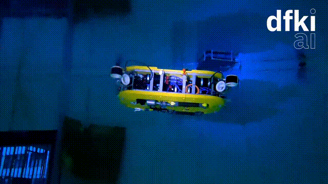
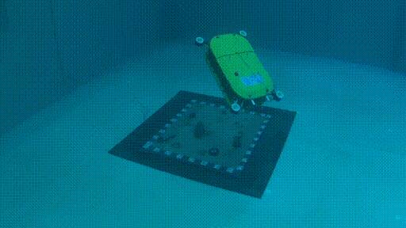
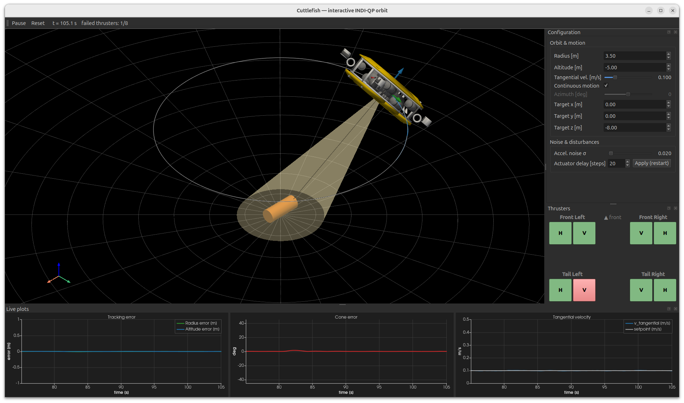
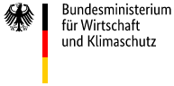
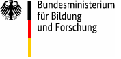
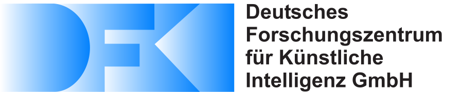

<div align="center">
<h1>Incremental Nonlinear Dynamic Inversion for the Hydrobatic Intervention AUV Cuttlefish</h1>
<h3>INDI &amp; INDI-QP — sensor-based attitude and fault-tolerant motion control for a 6-DOF AUV</h3>

<a href="https://dfki-ric-underactuated-lab.github.io/auv_control_indi/">🌐 Project Page</a> &nbsp;·&nbsp;
<a href="https://youtu.be/8u8k607lpn4">🎬 INDI Video</a> &nbsp;·&nbsp;
<a href="https://youtu.be/50bc1D_jC-o">🎬 INDI-QP Video</a>

<table>
<tr>
<td align="center"><br/><sub><b>INDI</b> — 90° pitch-up maneuver</sub></td>
<td align="center"><br/><sub><b>INDI-QP</b> — 360° fault-tolerant inspection</sub></td>
</tr>
</table>
</div>

This repository contains the simulation models and controllers behind two papers that
bring **Incremental Nonlinear Dynamic Inversion (INDI)** to the dual-arm intervention AUV
**Cuttlefish**, developed at the [DFKI Robotics Innovation Center](https://www.dfki.de/en/web/research/research-departments/robotics-innovation-center),
Bremen, Germany.

Model-based controllers for marine vehicles depend on an accurate dynamic model, which is
hard to obtain because of strongly nonlinear hydrodynamic effects. INDI instead trades
model accuracy for *sensor* accuracy: it linearizes the system incrementally using
acceleration and actuator feedback, requiring only a 6×6 mass-inertia matrix and an
actuation model.

| | Paper | Focus |
|---|---|---|
| **Work 1 — INDI** | *Attitude Control of the Hydrobatic Intervention AUV Cuttlefish using Incremental Nonlinear Dynamic Inversion* (IROS 2024) | Quaternion-based attitude control; 90° pitch-up maneuver |
| **Work 2 — INDI-QP** | *Prioritized Motion Control Robust to Actuator Failure for Hovering-Type AUVs using INDI-QP* | Passive fault-tolerant control; 360° inspection orbit |

INDI-QP **builds directly on** the INDI controller from Work 1, adding a quadratic-program
control allocation that prioritizes critical degrees of freedom under actuator failure.

---

## Work 1 — INDI (IROS 2024)

> **Attitude Control of the Hydrobatic Intervention AUV Cuttlefish using Incremental Nonlinear Dynamic Inversion**
> Tom Slawik, Shubham Vyas, Leif Christensen, Frank Kirchner
> *2024 IEEE/RSJ International Conference on Intelligent Robots and Systems (IROS 2024), Abu Dhabi, UAE.*
> [📄 Paper](https://www.dfki.de/fileadmin/user_upload/import/15045_20240704_root.pdf) · [🎬 Video](https://youtu.be/8u8k607lpn4)

We present an attitude control scheme for an AUV based on INDI. INDI trades off model
accuracy with sensor accuracy by incorporating acceleration feedback and actuator output
feedback to linearize a nonlinear system incrementally. The control task is a 90-degree
pitch-up maneuver, where Cuttlefish transitions from a horizontal traveling pose to a
vertical intervention pose. Compared to a classical model-based scheme in the maritime
test basin at DFKI RIC, INDI keeps the AUV much steadier both in the transitioning phase
and in the station-keeping phase.

## Work 2 — INDI-QP

> **Prioritized Motion Control Robust to Actuator Failure for Hovering-Type AUVs using INDI-QP**
> Tom Vincent Slawik, Shubham Vyas, Bilal Wehbe, Leif Christensen, Frank Kirchner
> [🎬 Video](https://youtu.be/50bc1D_jC-o)

INDI-QP extends INDI with a quadratic program to prioritize critical degrees of freedom
during actuator failure. We adapt it for the 6-DOF, eight-thruster Cuttlefish and evaluate
it on a 360° inspection trajectory around a fixed object kept in the sensor's line of
sight. By prioritizing critical degrees of freedom (roll/pitch over yaw and translation),
the controller safely executes the inspection even with fewer than six functional
thrusters, maintaining a significantly smaller line-of-sight error than a non-prioritized
INDI baseline. Passive fault tolerance is achieved **without RPM measurements** by running
a parallel thruster model inside the control architecture — no explicit fault detection
and isolation required.

---

## Simulation

For running the simulation, [Drake](https://drake.mit.edu/) is required. Install Drake
according to <https://drake.mit.edu/apt.html>.

Then install the required Python packages:

```bash
sudo apt update && sudo apt install python3 python3-pip python3-venv

python -m venv venv
source venv/bin/activate

pip3 install -r requirements.txt
```

### INDI — Pose & Velocity Control (Work 1)

Run the pose controller using INDI:

```bash
python3 examples/cuttlefish_pose_indi.py
```

The same maneuver with NDI / model-based control:

```bash
python3 examples/cuttlefish_pose_ndi.py
```

For completeness, a velocity controller (independent of a controlled pose) is also
provided:

```bash
python3 examples/cuttlefish_velocity_indi.py   # INDI
python3 examples/cuttlefish_velocity_ndi.py    # model-based
```

In each script there is a parameter section where you can change the initial conditions,
setpoints, controller gains, and filtering parameters; Gaussian sensor noise can also be
added. Two motion models are loaded: one for the simulated vehicle and one for the
controller. The control model can be perturbed via `motion_model_controller_randomize`
(0.0–0.8, where 0.8 randomizes each parameter by 80%). Increasing the perturbation affects
the model-based controller much more than INDI.

### INDI-QP — 360° Orbit Inspection (Work 2)

The easiest way to explore INDI-QP is the real-time desktop GUI:

```bash
python3 start_interactive_sim.py
```

<div align="center">
  
</div>

Click the thruster buttons (lower right) to fail or restore a thruster on the
fly — **green = enabled, red = failed** — and watch INDI-QP reallocate control
effort live. The configuration panel (right) adjusts the orbit (radius,
altitude, tangential velocity, target position) and accelerometer noise, the
toolbar has Pause and Reset, and the live plots (bottom) show the tracking,
line-of-sight, and tangential-velocity errors. Requires `PySide6`, `pyvista`,
and `pyvistaqt` (already in `requirements.txt`).

#### Scripted runs

Run the orbit controller using INDI-QP:

```bash
python3 examples/cuttlefish_orbit_indi_qp.py
```

The model-based variant:

```bash
python3 examples/cuttlefish_orbit_ndi_qp.py
```

By setting `thruster_configuration`, you can define a thruster failure scenario, which is
simulated after `t_fail`. Set the corresponding index to `0` to disable a thruster:

| Index | Thruster | Index | Thruster |
|-------|----------|-------|----------|
| 0 | Vertical front left | 4 | Horizontal front left |
| 1 | Vertical front right | 5 | Horizontal front right |
| 2 | Vertical tail right | 6 | Horizontal tail right |
| 3 | Vertical tail left | 7 | Horizontal tail left |

## Motion Models

During our experiments, we identified motion models using a linear and a linear-quadratic
drag model. The parameters are stored in `models/cuttlefish/`:

- `cuttlefish_linear_model.yml` — linear drag model
- `cuttlefish_quadratic_model.yml` — linear-quadratic drag model

## Project Page

A combined project page for both works is published via GitHub Pages and built from the
[`docs/`](docs/) folder:

<https://dfki-ric-underactuated-lab.github.io/auv_control_indi/>

# Acknowledgements

The work described in these papers has received funding by the German Federal Ministry of
Education and Research (grant no. 01IW22003) as well as the Federal Ministry of Economic
Affairs and Climate Action (grant no. 03SX540D).

<div align="center">
  
  
  <br class="blank" />
  
  
</div>

# License

This work has been released under the BSD 3-Clause License. Details and terms of use are
specified in the LICENSE file within this repository. Note that we do not publish
third-party software, hence software packages from other developers are released under
their very own terms and conditions. If you install third-party software packages along
with this repo, ensure that you follow each individual license agreement.

# Citation

**INDI (IROS 2024):**

T. Slawik, S. Vyas, L. Christensen and F. Kirchner (2024). "Attitude Control of the
Hydrobatic Intervention AUV Cuttlefish using Incremental Nonlinear Dynamic Inversion," in
2024 IEEE/RSJ International Conference on Intelligent Robots and Systems (IROS 2024), Abu
Dhabi, UAE.

```bibtex
@inproceedings{SlawikIndi2024,
    author    = {Tom Slawik and Shubham Vyas and Leif Christensen and Frank Kirchner},
    title     = {Attitude Control of the Hydrobatic Intervention AUV Cuttlefish using Incremental Nonlinear Dynamic Inversion},
    booktitle = {2024 IEEE/RSJ International Conference on Intelligent Robots and Systems (IROS 2024)},
    year      = {2024},
    address   = {Abu Dhabi, UAE}
}
```

**INDI-QP:** *Publication details to be announced — citation will be added once the paper
is published.*

```bibtex
@unpublished{SlawikIndiQP,
    author = {Tom Vincent Slawik and Shubham Vyas and Bilal Wehbe and Leif Christensen and Frank Kirchner},
    title  = {Prioritized Motion Control Robust to Actuator Failure for Hovering-Type AUVs using INDI-QP},
    note   = {Manuscript, publication details to follow},
    year   = {2025}
}
```
